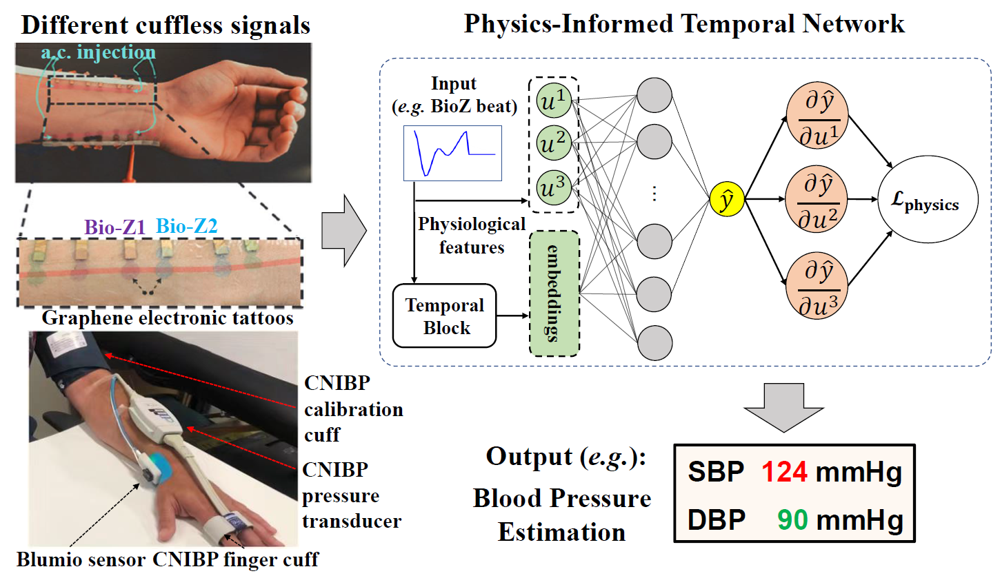
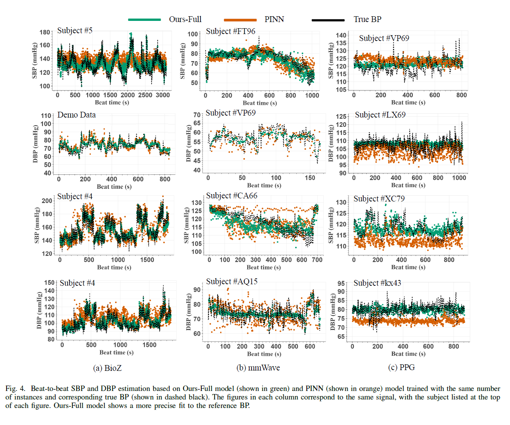

<div align="center" style="font-family: charter;">

<h1></br>PITN: Physics-Informed Temporal Networks for Cuffless Blood Pressure Estimation</h1>


<br />


[](https://arxiv.org/abs/2408.08488)
[](https://ieeexplore.ieee.org/document/11223230/)

<div>
    <a href="https://zest86.github.io/" target="_blank">Rui Wang</a><sup></sup>,</span>
    <a href="https://jueduilingdu.github.io/" target="_blank">Mengshi Qi</a><sup></sup>, </span>
    <a href="https://shaoyx.github.io/" target="_blank">Yingxia Shao</a><sup></sup>,</span>
    <a href="https://teacher.bupt.edu.cn/zhouanfu/en/index.htm" target="_blank">Anfu Zhou</a><sup></sup>,</span>
    <a href="https://teacher.bupt.edu.cn/mahuadong/en/index.htm" target="_blank">Huadong Ma</a><sup></sup></span>
</div>

<div>
    Beijing University of Posts and Telecommunications
</div>


<p align="justify"><i>Continuous blood pressure (BP) monitoring is essential for cardiovascular healthcare. While traditional cuff-based measurements are unsuitable for continuous tracking, emerging cuffless wearable sensors (e.g., PPG, bioimpedance) provide viable alternatives. However, existing estimation methods often overlook the inherent multi-periodicity and temporal dependencies of physiological signals. Furthermore, personalized modeling is severely hindered by the scarcity of subject-specific data. To address these challenges, we propose a novel Physics-Informed Temporal Network (PITN) integrated with adversarial contrastive learning for precise BP estimation across three modalities: bioimpedance, PPG, and millimeter-wave. Specifically, we first introduce the PITN to explicitly model the multi-periodicity and temporal variations of BP dynamics governed by cardiovascular cycles. To tackle data scarcity, we employ adversarial training to generate realistic physiological time series, enhancing model robustness. Additionally, we utilize contrastive learning to capture discriminative variations, aggregating signals with similar BP values in the latent space while separating dissimilar ones. Extensive experiments on three public datasets demonstrate the superiority and effectiveness of our proposed method over state-of-the-art approaches.</i></p>

</div>

## News
- **`2025-10`** :trophy: Exciting news! Our paper **"PITN: Physics-Informed Temporal Networks for Cuffless Blood Pressure Estimation"** has been accepted by **IEEE Transactions on Mobile Computing (TMC)**!
- **`2025-07`** :hammer_and_wrench: We updated `main.ipynb` to fix bugs and improve usability.
- **`2024-10`** :rocket: Initial release of the **PITN** project. Code and models are now available!

## Contents

- [News](#news)
- [Contents](#contents)
- [Results](#results)
- [Run](#run)
  - [Installation](#installation)
  - [Evaluation](#evaluation)
- [Acknowledgement](#acknowledgement)
- [Citation](#citation)


## Results


<div align="center">
    
</div>

## Run

###
To run the model results for the PITN Bio-Z to BP estimation run:
```bash
main.ipynb
```

### Installation

```bash
pip install numpy 
pip install pandas
pip install tensorflow
pip install sklearn
```

### Evaluation

Download the PITN model weight [here](https://drive.google.com/file/d/1_9USI6CYRoafcCqaDlHsz8UrnEyGHdq7/view?usp=drive_link), predictions on the test set, and alongside the train/test loss [here](https://drive.google.com/drive/folders/1CsKXXC9m8eWhPiULBgDoP6lzFthdsnPW?usp=drive_link).

## Acknowledgement

This code is partially adapted from:
- [pinn-for-physiological-timeseries](https://github.com/TAMU-ESP/pinn-for-physiological-timeseries)

We thank the original authors for their contributions.
## Citation

If you find our paper and code useful in your research, please consider giving us a star :star: and citing our work :pencil: :)
```
@article{wang2025pitn,
  title={PITN: Physics-Informed Temporal Networks for Cuffless Blood Pressure Estimation},
  author={Wang, R. and Qi, M. and Shao, Y. and others},
  journal={IEEE Transactions on Mobile Computing},
  year={2025},
  publisher={IEEE}
}
```

